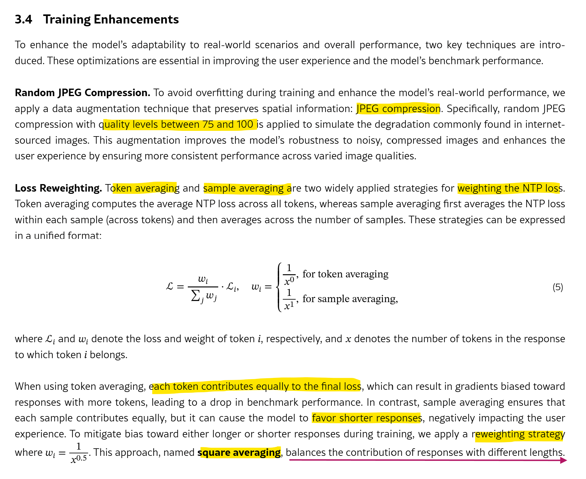

# ViT + BERT + CLIP obj
- https://huggingface.co/datasets/5CD-AI/Vietnamese-yfcc15m-OpenAICLIP
- https://huggingface.co/datasets/truongvu2000nd/LAION-vi

## InternVL
- InternVL https://arxiv.org/html/2412.05271v4
- VFM via Visual Linguistic Task https://alphaxiv.org/abs/2312.14238

- `448 × 448 image tile` is represented by `256 visual tokens`
- randomly initialized 2-layer MLP projector (to map visual token to LLM embeddings)

InternViT-300M-448px-Distill is a distilled variant of the teacher model, InternViT-6B-448px-V1.5, utilizing a cosine distillation loss. This model comprises 0.3B parameters, 24 layers, a hidden size of 1024, and 16 attention heads. Unlike the 6B version, the 0.3B variant employs standard LayerNorm [11] without QK-Norm [53]. To reduce distillation costs, we initialized this model using CLIP-ViT-Large-336px [195] where applicable, despite some architectural differences. After distillation, we integrated this model with an LLM and, following a similar procedure as described above, trained the vision encoder with dynamic high-resolution and the NTP loss. Then, we extracted the vision encoder and released it as InternViT-300M-448px. In this report, we further refined the InternViT-300M by incrementally pre-training the previous weights on a more diverse data mixture using the NTP loss, leading to the enhanced InternViT-300M-448px-V2.5.

### VLM inputs

### 3.2 Single Model Training Pipeline

- **https://huggingface.co/OpenGVLab/InternViT-300M-448px-V2_5**
- https://github.com/OpenGVLab/InternVL/blob/main/internvl_g/internvl/model/internvl_stage2_retrieval/modeling_intern_vit.py

---
# Intro to VLM
- https://www.alphaxiv.org/abs/2405.17247
- https://arxiv.org/html/2405.17247v1

Contrastive-based training is often better explained through an Energy-Based Models in which a model Eθ, parameterized by θ, is trained to `assign low energy to observed variables` and `high energy to unobserved ones`. **Data from a target distribution should have low energy** while any other data points should have higher energy.

# Perception Encoder
- https://x.com/gabriberton/status/1922542732993544657

**CLIP Style: Contrastive Language-Image Pre-training**
Model học cách liên kết hình ảnh với mô tả văn bản tương ứng trong cùng một không gian biểu diễn để dự đoán văn bản nào đi với hình ảnh nào trong một tập hợp các cặp hình ảnh-văn bản. Giúp mô hình hiểu mối quan hệ giữa nội dung trực quan và ngôn ngữ.

The CLIP-like models are an engineering feat, trained with standard CLIP-style image-text alignment with known best practices: progressively increasing resolution, LAMB optimizer, strong augmentation, and lots of data. 

Unlike previous work (CLIP, SigLIP, AIMv2), they add a second training step with videos-text alignment: for each video, they sample 8 frames, pass them through the ViT, average the 8 embeddings and align them with the text. 

**The ViT encoder (called Perception Encoder, or PE) is SOTA on many tasks**: not only the usual tasks where CLIP models excel ...(like classification, retrieval, text-image retrieval), but also on tasks where SSL models (usually DINOv2) are best (and usually widely outperform CLIP-like models), like `depth estimation`, `segmentation` and `tracking`. Yes, **it seems to be good at everything.**

An interesting finding is that often in ViTs **the output of the last layer is not the best**: this is true for multiple ViTs like DINOv2 and AIMv2. Another interesting thing is that they don't use the sigmoid loss like SigLIP, but they use the more classic CLIP-style training. I don't really understand why, considering that SigLIP works great and (usually paired with a Qwen LLM) is the de facto standard for modern VLMs.

This ViT is then used in the VLM from the second paper, called **PerceptionLM**. The impressive thing is that PerceptionLM has comparable results with Qwen2.5VL despite using a weaker LLM (Llama3 vs Qwen2.5), which IMHO is a testament to how good the vision encoder is.

And one last small thing I didn't like: the papers don't cite the `INFOnce loss` paper and refer purely to the "CLIP loss", despite it being a pillar for both models [11/11]

- https://github.com/facebookresearch/perception_models
- https://arxiv.org/abs/2504.13181
- https://arxiv.org/abs/2504.13180

