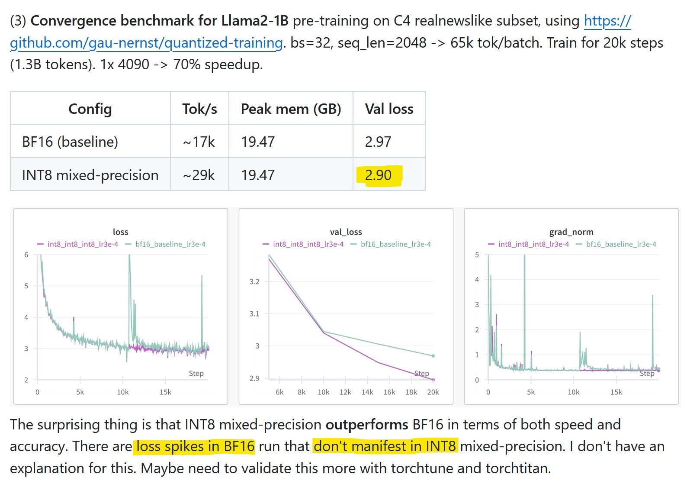
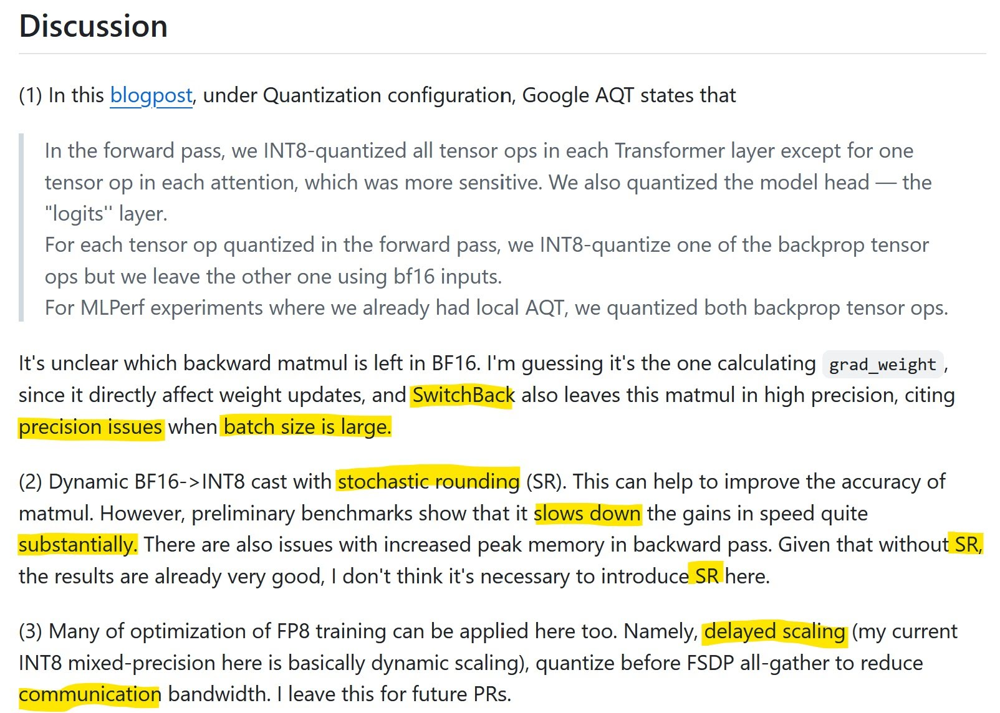
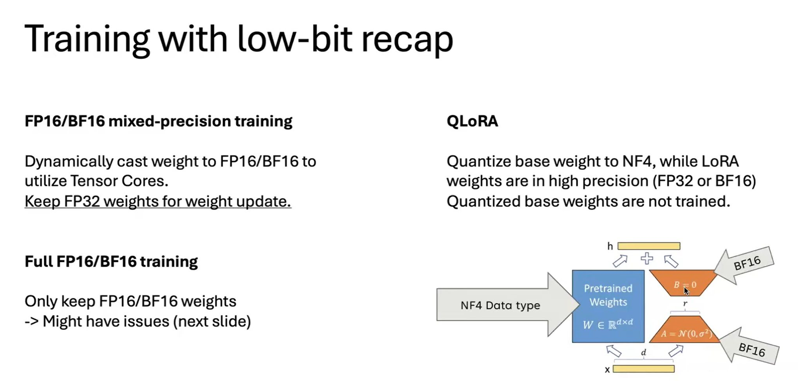
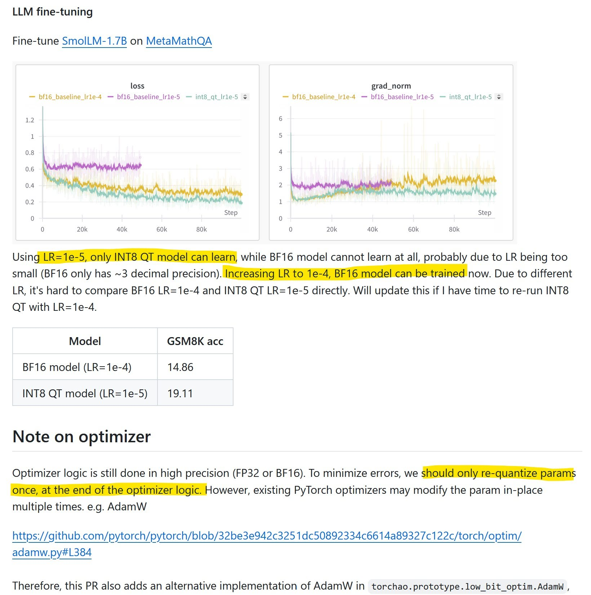
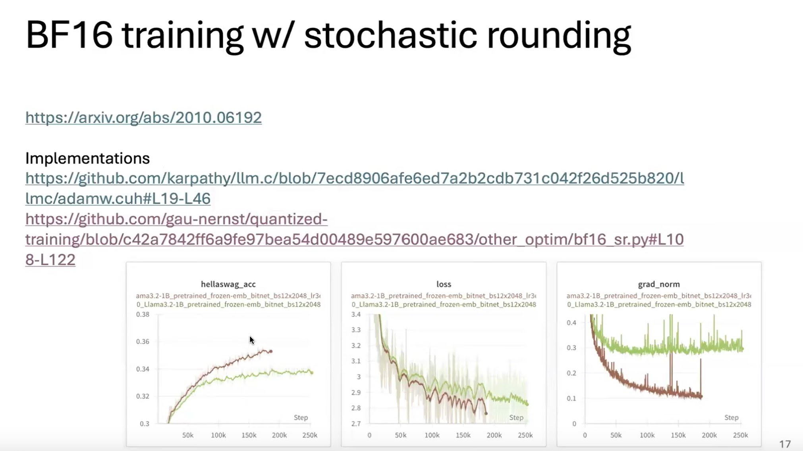
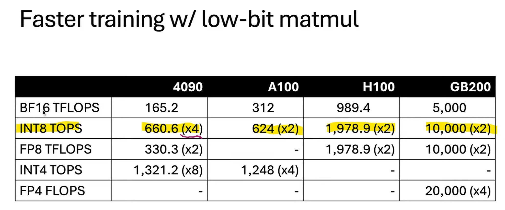
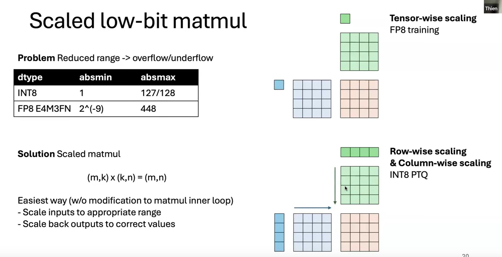
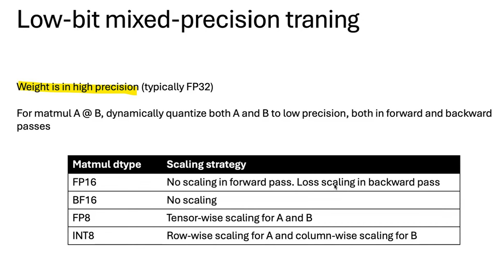
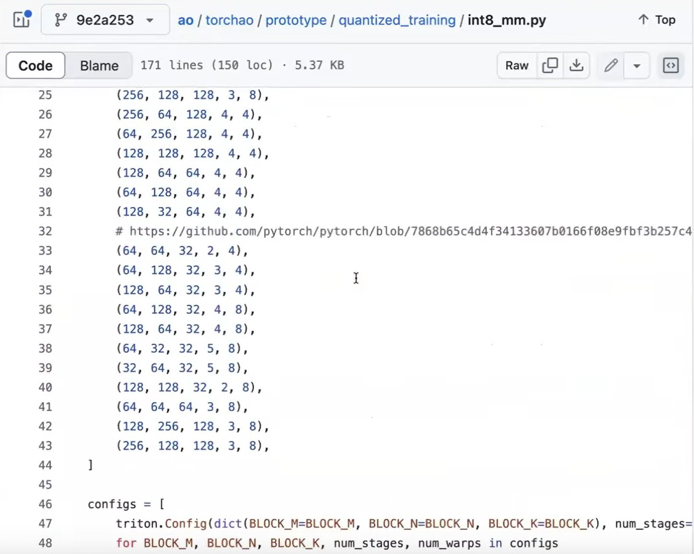
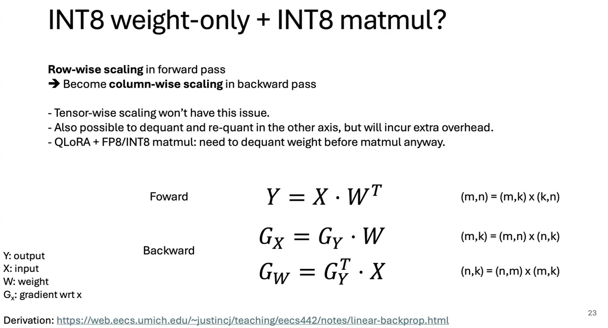

# [JetFire fully INT8 Training](https://github.com/thu-ml/Jetfire-INT8Training)
by using a novel `per-block quantization` scheme to **handle activation and gradient `outliers`**. By partitioning matrices into small blocks and scaling each block independently, JetFire preserved accuracy comparable to FP16 training while obtaining ∼40% end-to-end speedup and 1.49× reduction in memory usage. The JetFire approach is conceptually `similar to the FP8 DeepSeek training technique`, which used larger block sizes.

> **Figure 1**: Visualization of INT8 data flow. (a) Floating point training with FP data flow. (b) Existing works on quantized training with FP data flow. (c) Ours INT8 training forward process, with INT8 data flow. 𝐗 refers to the activation, and 𝐒 refers to the corresponding quantization scale factors.

- _Post-Training Quantization_ (PTQ)
- _Quantization-Aware Training_ (QAT)
- _Fully Quantized Training_ (FQT)
- _Per-token Quant_   = _Row Scale_ Activations  => Scale
- _Per-channel Quant_ = _Col Scale_ Weights      => Matmul
- _Per-block Quantization_ = B×B Scale factor    => Tiled Scale Matmul

- _Quantize-Compute-Dequantize_ (QCD) 
  * Q: `FP16 → INT8`: X_fp16 → Q(X) = X_int8
                      W_fp16 → Q(W) = W_int8
  * C: `INT8 × INT8 → INT32`:
        Y_int32 = X_int8 × W_int8^T

  * D: `INT32 → FP16`:
       Y_fp16 = Q^(-1)(Y_int32)

=> 1 feature vector (hidden vector / embedding vector) có 1 hệ số scales, nếu hidim là 2048 thì 2048 elems mới có 1 scale factor => Vẫn thưa. Nếu chia block, giả sử 32 x 32 thì 1024 elems có 1 scale factor => giúp tăng độ chính xác!

Hopper architecture, FP8 TransformerEngine (Nvidia, 2022) incorporates `per-layer scaling` to reduce quantization errors and proposes using `E4M3` during forward and `E5M2` during backward passes to adapt. (Perez et al., 2023) explores adjusting `per-tensor scaling` biases to improve accuracy.

# [HALO](https://github.com/IST-DASLab/HALO)
improved upon JetFire in terms of the **accuracy-speedup trade-off** in INT8, specifically focusing on low-precision fine-tuning.

---

# INT8 mixed-precision training
- https://github.com/pytorch/ao/pull/748
- https://youtu.be/Br07GsnnvWc?t=1385
- thiếu smoothing?

- **Quantized training**: model weights are quantized. This is a strict requirement. Does not matter what is the compute precision. Examples of this: Q-GaLore, JetFire.

- **INT8 mixed-precision training**: model `weights are in bf16`, while `compute dtype for most ops is in INT8`. One difference is that in FP16/BF16 mixed-precision training, matmul will return FP16/BF16 outputs, while for INT8 mixed-precision training, the returned dtype is usually not INT8. Examples include Google AQT and SwitchBack.

There are 3 main benefits of using low-precision dtype for training (the extent depends on the actual strategies):

- `Memory`: reduce memory footprint by: 
  - model weights, 
  - activations,
  - gradients, and  
  - distributed communication bandwidth.

- `Speed`: 
  - speedup compute-bound ops with low-precision hardware instructions (e.g. INT8 Tensor Cores), and 
  - speedup memory-bound ops with quantized inputs/outputs.

- WYTIWYS (What you train is what you serve https://github.com/google/aqt)

## INT8 mixed-precision

In mixed-precision training, we can down-cast activations and weights dynamically to INT8 to leverage faster matmuls. However, since INT8 has very limited range [-128, 127], we perform `row-wise quantization`, similar to how **INT8 post-training quantization (PTQ) is done**. Weight is still in original precision.

> 3090/4090 INT8 tensor cores trong spec sheet là 4x faster than BF16 tensor cores.
> `Real benchmark thì cỡ 3-3.5x`

this blogpost https://cloud.google.com/blog/products/compute/accurate-quantized-training-aqt-for-tpu-v5e

- - -

# stochastic rounding

Tương tự như F32 training convert to FP16/BF16 khi tính toán để sử dụng tensor cores.
Mix int8, convert to int8 khi tính toán, còn lưu trữ vẫn cùng FP16/BF16 ...

=> có 1 giải pháp đơn giản cho vấn đề trên là SR (stochastic rounding)

!!! Thay vì làm tròn cứng thì sử dụng làm tròn có xác suất !!!

https://github.com/pytorch/ao/pull/644

SR cải thiện đáng kể bộ bf16 optimizer.

- - -

4090 được hưởng lợi nhiều từ 8-bit training, có thể 4x so với bf16, int8 nhanh tương đương A100
- Thực tế đo lường thì 4090's int8 x3.5 bf16.
- Áp dụng training thì `x1.7 lần` cho toàn bộ pipeline. 

int8 bị vấn đề độ chính xác thấp (sai số cao), xử lý bằng scaled matmul, 

`torch.compile` có thể dùng để quant nhưng nó chưa support 1 số thứ, ví dụ triton quant configs.
quant config giúp tăng chất lượng nhiều.

Đa phần code đc sinh bởi torch.compile và chỉ cần custom 1 số đoạn code (scale ...) áp dụng cho cả forward và backward

