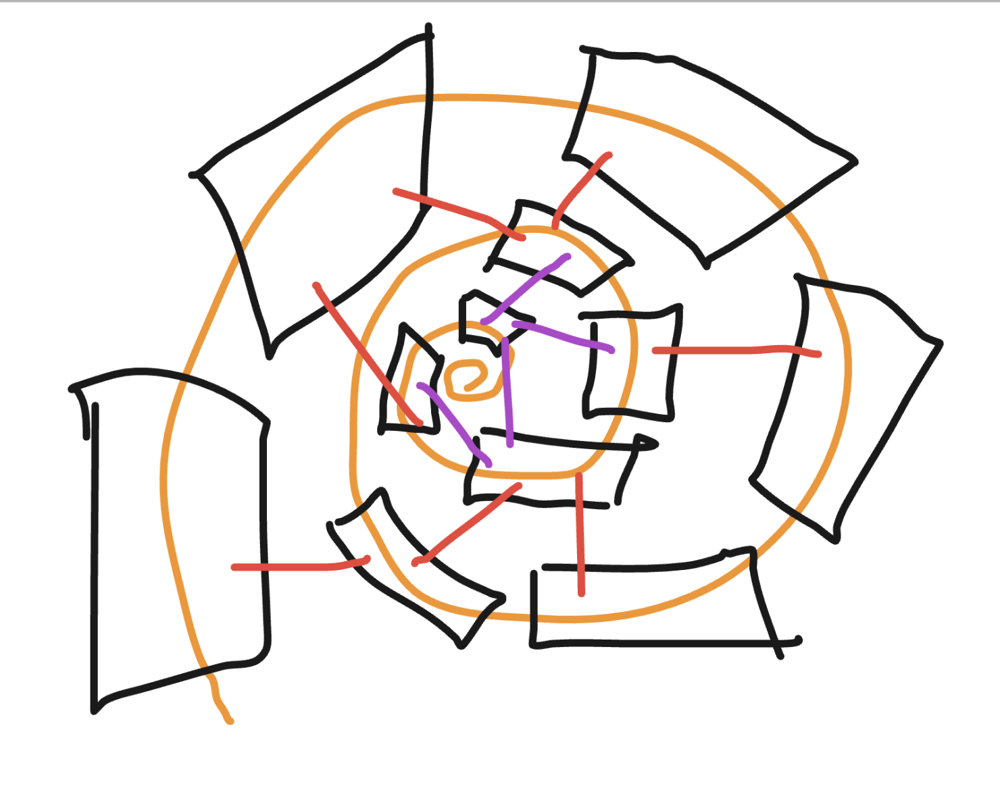

# Truyền dẫn linh hoạt giữa các layer (dạng xoắn ốc)

**Hình dung làm sao làm được ma trận layer dạng xoắn ốc spiral**
**Mỗi layer đều có thể output tới thẳng tầng out cuối**
```
Layer 1: 256 dim
Layer 2: 256 dim
Layer 3: 512 dim
Layer 4: 1024 dim
Layer 5: 1536 dim
Layer 6: 2560 dim
```
Khi forward x qua mỗi layer, sẽ qua một cái gate subnet, calculate logits tới layer cuối cùng luôn. Khi gặp vấn đề phức tạp, nó sẽ cần phải forward qua nhiều layer hơn, high dim hơn, khi gặp vấn đề đơn giản, nó sẽ chỉ cần chạy qua vài layer đầu rồi exit sớm ra kết quả. **subnet này sẽ train reward làm sao minize số k layer cần phải pass** mà vẫn tối ưu output.

- phân bố low layers lên low perf devices, high layers lên GPUs
- hạ tầng bị degrade performance do overload, thì mình cho nó exit sớm



**idea về xoắn ốc nữa đó là nó input ko phải chỉ từ layer trước theo một chiều, mà là đa chiều.**
**có thể pass data vào layer siblings**

- cái chính yếu làm cho nó có nhiều connection có nhiều nếp nhăn, mà output on demand
- những khối nhỏ sẽ xử lý những thông tin đơn giản encode features
- rồi khối to làm nhiệm vụ tổng hợp suy luận
- và bất kì lúc nào muốn output đều được
- chưa chắc khối to làm việc lại hiệu quả hơn hơn khối nhỏ

---

## MatFormer
- Matryoshka Former https://arxiv.org/html/2310.07707v2
- FlexTron https://arxiv.org/html/2406.10260v1
<!-- 
> Elastic Multi-Head Attention (MHA)
 -->


Nested Feed Forward Network (FFN):

- Smaller FFN blocks are nested within larger ones
- 4 nested granularities with FFN ratios of {0.5, 1, 2, 4}
- All nested models share parameters, with smaller models using subsets of the larger model's parameters.

Training:

- Random sampling of different granularities during training
- Each granularity optimized independently but sharing parameters

Mix & Match Inference:
- Ability to extract exponential number of submodels by combining different granularities across layers

**Phức tạp trong quá trình huấn luyện**: Việc lấy mẫu ngẫu nhiên các granularity khác nhau trong quá trình huấn luyện có thể phức tạp hơn so với huấn luyện các mô hình độc lập.

---

**[LayerSkip](https://github.com/facebookresearch/LayerSkip)**
- https://arxiv.org/html/2404.16710v4
- layer dropout with rates increasing across layers
- early exit loss with shared head 
- speculation decode để vừa tăng tốc vừa giữ độ chính xác (cân bằng)


> training recipe that combines layer dropout and early exit loss

Layer Dropout: Skipping layers stochastically during training is referred to in literature with different terms such as stochastic depth or layer dropout. It was first explored in ResNets by Huang et al. (2016). ConvNext Liu et al. (2022) used higher layer dropout rates for larger models: 0.1/0.4/0.5/0.5 for ConvNeXt-T/S/B/L respectively when trained on ImageNet Deng et al. (2009). However, when training on the larger ImageNet-22K dataset, ConvNeXt used smaller layer dropout rates: 0.0/0.0/0.1/0.1/0.2. In language models, LayerDrop Fan et al. (2020) applied dropout to every other transformer layer, which increased its robustness to pruning layers at inference time.  Zhang and He (2020) increased the pretraining speed of BERT by applying a dropout rate that progressively increased every iteration as well as every layer. To the best of our knowledge, layer dropout for training decoder-only models, or scaling language models to large model sizes or large datasets has not been explored. Moreover, our paper is the first to propose using layer dropout to improve early exit inference.

Our approach has three different stages:

1. Training using Layer Dropout & Early Exit Loss
2. Inference using Early Exit
3. Verification and Correction using Speculative Decoding

---

train a neural network to work with randomized subsets of its parameters, then do neural architecture search to find the optimal subset for a given device => reminds me of dropout layer lol!

- https://x.com/vikhyatk/status/1921018763329040764
- https://arxiv.org/abs/2310.07707
