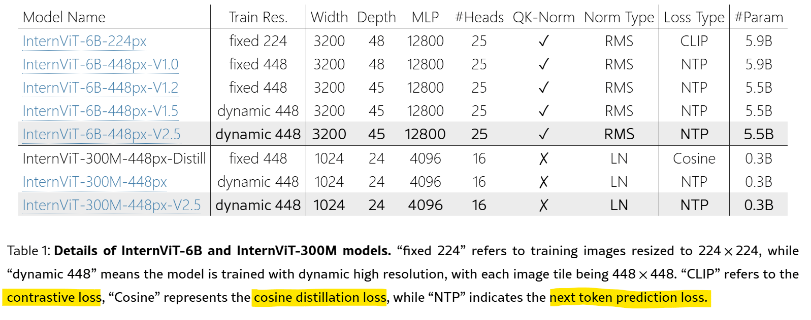

# Efficient Tokenizer
_modded-nanogpt + tokenmonster = 40% speedup_
- https://x.com/alexjc/status/1881410039639863622
- https://huggingface.co/datasets/alexjc/fineweb-tokmon-10B/tree/main/english-28416-balanced
Tôi phát hiện có thể đạt điểm Common Sense tương đương nhưng nhanh hơn 40% bằng cách chuyển sang bộ từ vựng TokenMonster tùy chỉnh có cùng kích thước với GPT-2. Tuy nhiên, do validation loss giữa các bộ từ vựng khác nhau không thể so sánh trực tiếp, bộ từ vựng tôi dùng lúc đó không vượt trội hơn GPT-2 trên thang đo riêng của nó. Sau nhiều thử nghiệm để tận dụng lợi thế 40% này, tôi quyết định giảm kích thước từ vựng xuống hơn 40%. Vì **các mô hình đạt kỷ lục sử dụng embedding ở nhiều vị trí**, việc giảm số lượng token tạo ra sự khác biệt đáng kể về hiệu suất (giảm hơn 10% mỗi bước). Bộ từ vựng gồm 28_416 token được tạo ra bằng cách lọc các mục từ bộ từ vựng TokenMonster english-100256-balanced mặc định.
1. `lọc thủ công` các token dựa trên các quy tắc cứng đơn giản
2. `loại bỏ các token ít được sử dụng nhất`.
Các token còn lại có xu hướng nguyên tử hơn, và ít token tổng hợp kết hợp nhiều thành phần: ví dụ như từ và dấu câu. **Tôi tin rằng sự đơn giản tương đối của các token là yếu tố cho phép tăng tốc độ học lên 8%.**

## BPEasy
- Treat text data at the **byte-level first** --- convert to bytes before training.
- Always use a **regex-based split pre-tokenizer**.
```python
# example regex from GPT-4
r=r"""(?i:'s|'t|'re|'ve|'m|'ll|'d)|[^\r\n\p{L}\p{N}]?\p{L}+|\p{N}{1,3}| ?[^\s\p{L}\p{N}]+[\r\n]*|\s*[\r\n]+|\s+(?!\S)|\s+"""
```
## Byte Latent Transformer


---

## vec2vec: translate text embeddings across different spaces without any paired data or encoders
- https://x.com/rishi_d_jha/status/1925212069168910340
- **https://x.com/jxmnop/status/1925224618060587523**

## mixture of tokenizers
- https://x.com/omouamoua/status/1922934072730403228
- https://github.com/snimu/blog/tree/main/contents/mixture-of-tokenizers
- https://github.com/snimu/blog/blob/main/contents/mixture-of-tokenizers-math/article.md
- https://github.com/snimu/blog/blob/main/contents/mot-scaling/article.md

## Selftok: Discrete Visual Tokens
https://selftok-team.github.io/report

## CLIP-like models and VLMs from Meta 
https://x.com/gabriberton/status/1922542722558067079

---

- Learning Deep Representations of Data Distributions
  https://x.com/YiMaTweets/status/1924068626694598683
- https://x.com/_reachsumit/status/1924348175651135875
- qwen pre tknz https://x.com/YouJiacheng/status/1923712356229710319
- Self-Interpretation of LLM Embeddings https://x.com/TheAhmadOsman/status/1923294932845912344
- Demystifying Embedding Spaces using Large Language Models (2023) - arXiv:2310.04475
- Siêu vị trí trong không gian biểu diễn https://x.com/YizhouLiu0/status/1923210466198773867

---

## ModernBERT
https://arxiv.org/html/2412.13663v2

**Alternating Attention** from Gemma et al. (2024), attention layers in ModernBERT alternate between global attention, where every token within a sequence attends to every other token, and local attention, where tokens only attend to each other within a small sliding window Beltagy et al. (2020). In ModernBERT, every third layer employs global attention with a RoPE theta of 160,000 and the remaining layers use a 128 token, local sliding window attention with a RoPE theta of 10,000.

We use Flash Attention’s variable length attention and RoPE implementations, allowing jagged attention masks and RoPE applications on one unpadded sequence. **ModernBERT unpads inputs before the token embedding layer and optionally repads model outputs** leading to a 10-to-20 percent performance improvement over other unpadding methods.

ModernBERT has `22 and 28 layers` for the base and large models, for a total parameter count of `149 and 395 million`, respectively, striking the balance between downstream performance and hardware efficiency. ModernBERT `base has a hidden size of 768` with a GLU expansion of 2,304, while `large has a hidden size of 1,024` and GLU expansion of 5,248. These ratios allow optimal tiling across tensor cores and the most efficient tiling across the differing number of streaming multiprocessors on our target basket of GPUs. More details on model design are provided in [Appendix B](https://arxiv.org/html/2412.13663v2#A2).

We warmup ModernBERT’s batch size from `768 to 4,608` over 50 billion tokens and from `448 to 4,928` over 10 billion tokens, for -base and -large, respectively, with an uneven token schedule so each batch size has the same number of update steps.

**Context Length Extension** After training on `1.7 trillion tokens at a 1024 sequence length` and RoPE theta of 10,000, we extend the native context length of ModernBERT to 8192 tokens by increasing the global attention layer’s RoPE theta to 160,000 and train for an additional 300 billion tokens. We first train at a constant lower learning rate6 of 3e-4 for 250 billion tokens on an 8192 token mixture of the original pretraining dataset sampled following  Fu et al. (2024).

## ViT, VLM
- InternVL https://arxiv.org/html/2412.05271v4
- VFM via Visual Linguistic Task https://alphaxiv.org/abs/2312.14238


- `448 × 448 image tile` is represented by `256 visual tokens`
- randomly initialized 2-layer MLP projector (to map visual token to LLM embeddings)

InternViT-300M-448px-Distill is a distilled variant of the teacher model, InternViT-6B-448px-V1.5, utilizing a cosine distillation loss. This model comprises 0.3B parameters, 24 layers, a hidden size of 1024, and 16 attention heads. Unlike the 6B version, the 0.3B variant employs standard LayerNorm [11] without QK-Norm [53]. To reduce distillation costs, we initialized this model using CLIP-ViT-Large-336px [195] where applicable, despite some architectural differences. After distillation, we integrated this model with an LLM and, following a similar procedure as described above, trained the vision encoder with dynamic high-resolution and the NTP loss. Then, we extracted the vision encoder and released it as InternViT-300M-448px. In this report, we further refined the InternViT-300M by incrementally pre-training the previous weights on a more diverse data mixture using the NTP loss, leading to the enhanced InternViT-300M-448px-V2.5.



### VLM inputs


### 3.2 Single Model Training Pipeline


### InternLM3 (có liên quan tới InternVL?)
https://huggingface.co/internlm/internlm3-8b-instruct/blob/main/modeling_internlm3.py

---

## mGPT: Stand-alone Autoregressive Image Modeling
https://github.com/Alpha-VLLM/Lumina-mGPT-2.0


