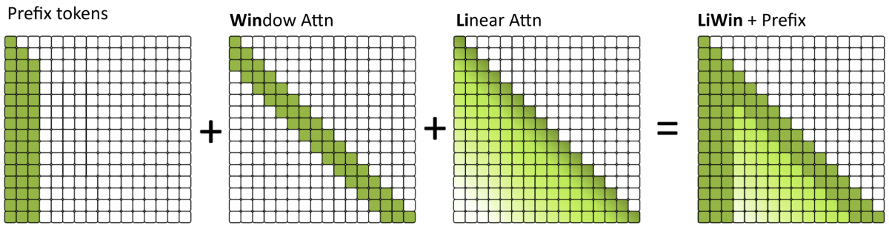

## `LiWin` `Li`near Attention + `Win`dow Attention
- https://github.com/m-a-n-i-f-e-s-t/power-attention
- Gated DeltaNet + SWA + Mamba2 https://www.alphaxiv.org/abs/2412.06464
- DeltaFormer https://ar5iv.labs.arxiv.org/html/2505.19488v1
  - https://youtu.be/vXjk1LF-qqg
  - https://asap-seminar.github.io/assets/slides/deltaformer_slide.pdf

__Kết hợp best SWA (local) với Linear Attention (global)__

- Hymba: 
    - https://www.youtube.com/watch?v=a31C8ahIDhk
    - https://asap-seminar.github.io/assets/slides/ASAP%20Talk_%20Hymba-Small%20Hybrid%20Language%20Model.pdf
    
### [Taipan: Mamba + Selective Attention Layers (SALs)](https://arxiv.org/html/2410.18572v1)

### [Based = Li + Win mỏng (Linear Attn + SWA mỏng)](https://www.alphaxiv.org/abs/2402.18668v2)

## Các biến thể của Attn
- `Glo` thiên về tóm tắt / toàn cục, kiểu như `Li`
- `Sel` chọn những khối tokens quan trọng để attn
- `Win` cục bộ theo cửa sổ, điển hình là `SWA` vô cùng đơn giản và hiệu quả nhất
- `Loc` local_attention mở rộng và look backward xa hơn `SWA`

## Win should use Trainable Sparse Attention
- `MoSA` = `Sel`; có thể kết hợp với local_attention nên hoàn toàn có thể thay thế `SWA`
- `NSA` = `Glo` + `Sel` + `Win`; có thể thay thế mọi loại block (cả Li và Win)
    - Vì Li đã có global, có thể chỉ dùng `Win` và `Sel` của NSA?
- `Taipan` = `Sel` + `Win`; => Có thể viết lại `Taipan Sel` (SALs) để dùng với `Win`
- `Based` = Li`Glo` + `Win` mỏng; `LiGlo` = Taylor Exponential Linear Attention nhanh nhẹ

# Learn at Test Time
- Titans: Learning to Memorize at Test Time https://arxiv.org/abs/2501.00663
- RNNs with Expressive Hidden States https://arxiv.org/abs/2407.04620
- Gated Delta Networks: Improving Mamba2 with Delta Rule https://arxiv.org/abs/2412.06464

---

# FoX Forgetting Transformer

Forget gate có norm term của RNN => biến đổi sang dạng song song của Linear Attn => đổi kernel function sang exp thì được dạng forget gate của softmax attn

ShiftLinear là một lớp (layer) trong kiến trúc FoX (Pro) dùng để thực hiện một phép tính gọi là "KV-shift," hay dịch chuyển token phụ thuộc vào dữ liệu. Lớp này tính toán các giá trị "key" và "value" mới tại một thời điểm bằng cách lấy trung bình có trọng số giữa giá trị ở thời điểm hiện tại và giá trị ở thời điểm ngay trước đó. Mục đích là để kết hợp thông tin từ token liền kề, một kỹ thuật được lấy cảm hứng từ các mô hình chuỗi hồi quy (recurrent sequence models). Tác dụng chính của ShiftLinear (thông qua cơ chế KV-shift) là để tăng cường khả năng của mô hình trong việc nắm bắt các mối quan hệ cục bộ và tuần tự giữa các token liền kề nhau. => có thể thay bằng causal conv1d?

FoX vượt trội hơn softmax attention truyền thống nhờ việc tích hợp cơ chế "forget gate" - một khả năng mà attention chuẩn không có.

**Lý do chính:**

1. **Cơ chế quên thông tin linh hoạt**: FoX có thể "quên" thông tin quá khứ một cách có chọn lọc và phụ thuộc vào dữ liệu. Bài báo nêu: "Transformer thiếu một cơ chế tường minh để quên thông tin quá khứ theo cách phụ thuộc vào dữ liệu." FoX khắc phục điểm yếu này bằng cách down-weight các unnormalized attention scores thông qua forget gate.

2. **Kết hợp ưu điểm của cả hai thế giới**: FoX giữ được khả năng xử lý long-context của Transformer trong khi tích hợp cơ chế forget gate quan trọng từ các mô hình chuỗi hồi quy. Như bài báo chỉ ra: "cơ chế này... đã được chứng minh là `quan trọng` trong thành công của chúng trong các `tác vụ short-context`."

3. **Kết quả thực nghiệm ưu việt**: Theo Figure 2, FoX outperform Transformer trên long-context language modeling, length extrapolation, và short-context downstream tasks. Cụ thể, FoX duy trì được per-token loss giảm dần trong toàn bộ training context length, cho thấy việc sử dụng hiệu quả toàn bộ ngữ cảnh.

4. **Không cần positional embeddings**: Khác với Transformer chuẩn cần RoPE, FoX có thể hoạt động hiệu quả mà không cần positional embeddings, như được nêu: "nó không cần bất kỳ positional embeddings nào."

5. **Giữ được khả năng truy xuất thông tin của attn**: Trong needle-in-the-haystack test (Figure 4), FoX đạt "near-perfect accuracy" trong training context length, trong khi các mô hình chuỗi hồi quy khác thất bại.

[ **Forget gate**: Cơ chế "cổng quên" giúp mô hình quyết định thông tin nào từ quá khứ nên được giữ lại hay loại bỏ; **Down-weight**: Giảm trọng số hoặc tầm quan trọng của một giá trị trong tính toán; **Length extrapolation**: Khả năng xử lý các chuỗi dài hơn so với độ dài được huấn luyện; **Needle-in-the-haystack test**: Bài kiểm tra đánh giá khả năng tìm và truy xuất thông tin cụ thể trong một đoạn văn bản dài. ]
