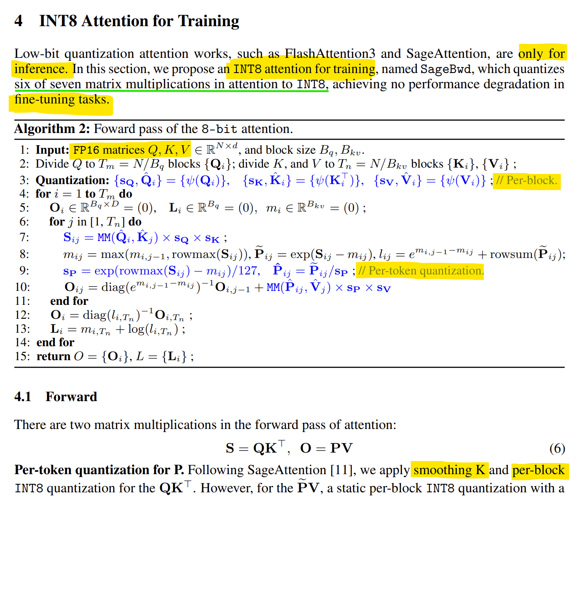
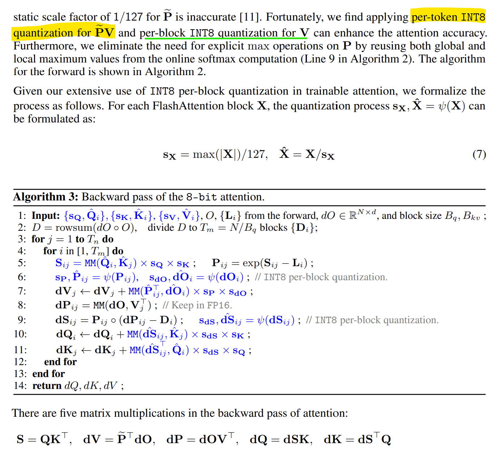

## Có ba thứ cần tìm hiểu về gamming gpus

1. có thể train fp8 weights được không? => ĐƯỢC! nếu dùng fp4 kernel trên 50xx

2. Full (fwd+bwd) attention kernels nào phù hợp?
- flash-attn_3 hỗ trợ FP16 / BF16 fwd & bwd, FP8 fwd, chưa compiled đc trên 4090.
- Có kernels nào nhanh hơn flash_attn không?
  - https://www.alphaxiv.org/overview/2505.11594 INT8 SageBwd tốt cho finetune, pretrain yếu

3. Kỹ thuật nào hiệu quả nhất (tốc độ cao + chính xác) fp4/fp8/int8/int4/mixed matmul?

**TODO**
- [ ] Áp dụng HT trong fwd và SR trong bwd trong INT8 Mixed

- [ ] Activations đang chiếm nhiều vram nhất => nên quant (giảm 1/2)

- [ ] Dùng Tile/block scale hoặc tensor scale để có thể dùng lại bwd

ROUNDING & SMOOTHING
--------------------
|Method | effN (fwd) | effD (bwd) | Misalignment |
|-------|------------|------------|--------------|
|QuEST  |  0.65 ✅  |   0.18 ❌  |  1.3×10⁻²    |
|SR     |  0.44 ❌  |   0.85 ✅  |  0           |

- QuEST Fwd
  - `Hadamard Transform` (HT) biến dist gần gaussian để smooth outlier
  - `MSE-optimal fitting` tìm tensor scaling factor tối ưu để min L2 error
  - `RMS norm` chuẩn hoá về `N(0, 1)` trước khi quant

- Quartet Bwd 
  - `final_gradient = stochastic_round(computed_gradient)`

## SageBwd
|Activation|Storage|Computation|Lý do|
|-|-|-|-|
|Q, K, V (input)|	FP16	|INT8	|Input precision, quantize khi compute|
|S (scores)     |	FP16	|FP16	|Intermediate softmax cần precision   |
|P (attention)  |	FP16	|INT8	|Quantize cho PV multiplication       |
|dOV^T	        | FP16	|🔴 FP16	|Critical cho gradient accuracy!  |
|dS, dQ, dK	    | FP16	|INT8	|Gradients cần FP16 storage           |

The accuracy loss in `dS` will continuously accumulate errors into `dQ` (Q's grad) and `dK` during the recurrent process along the sequence length in FlashAttention’s backward pass, meaning longer sequences lead to greater error accumulation. Therefore, we maintain `dOV^T` in FP16 while accelerating the other four matrix multiplications using INT8 per-block quantization.

||||
|-|-|-|
