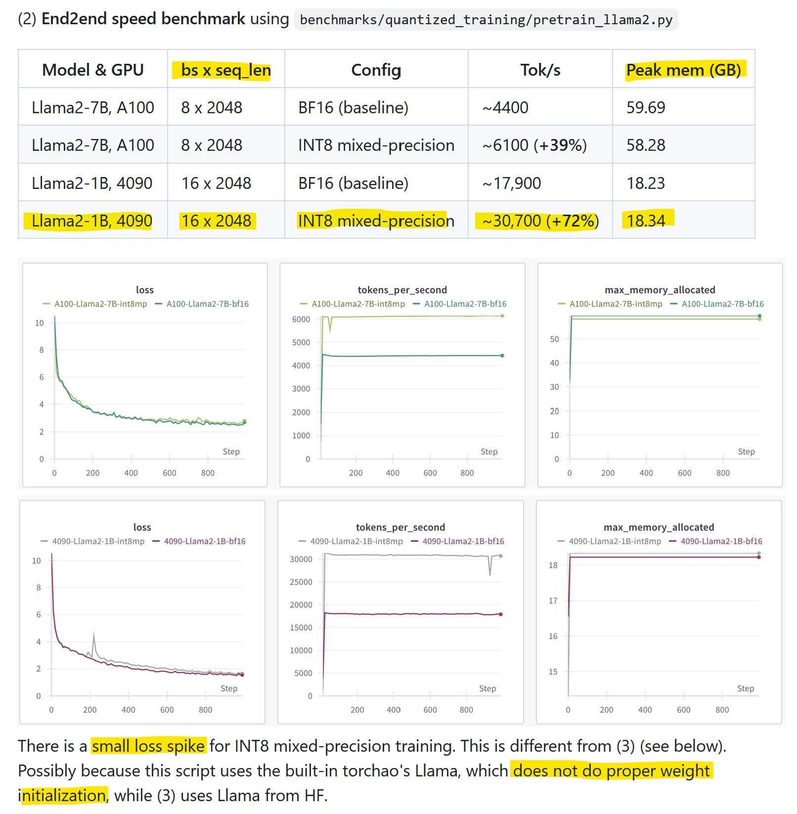
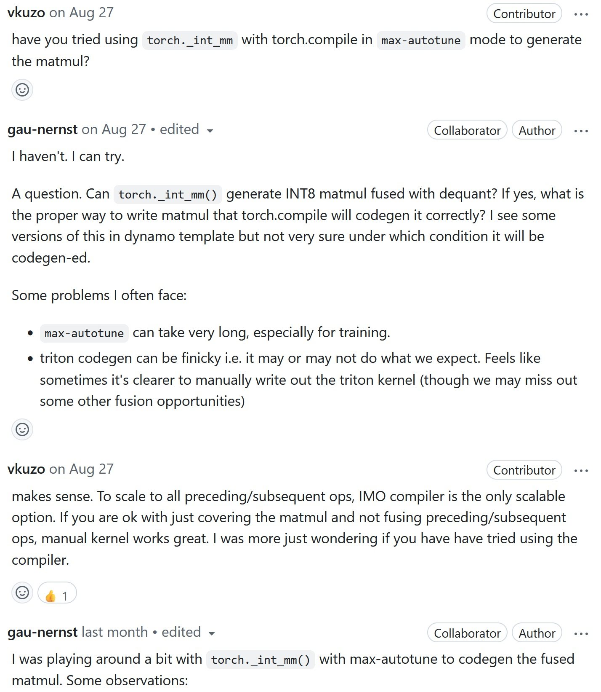
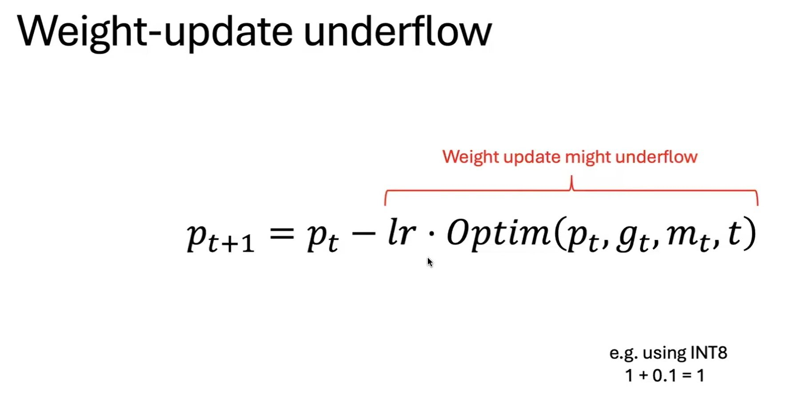
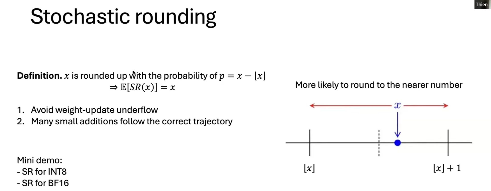
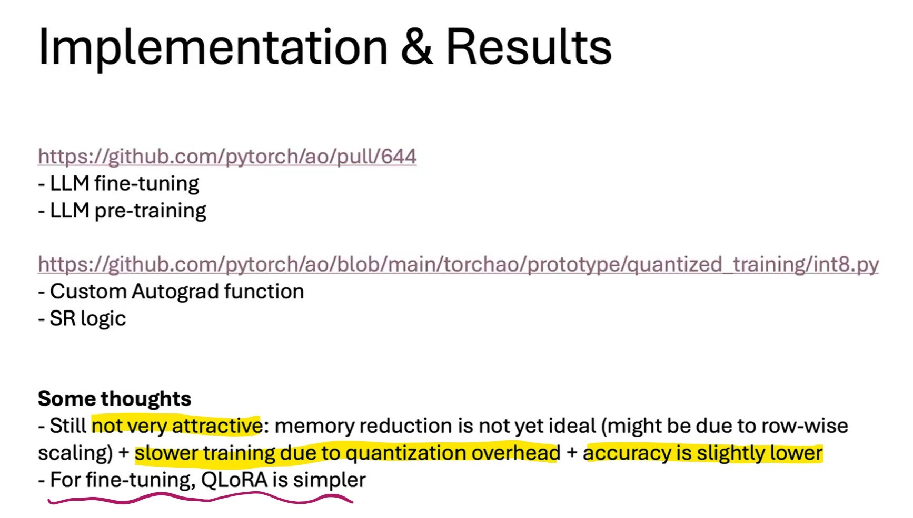
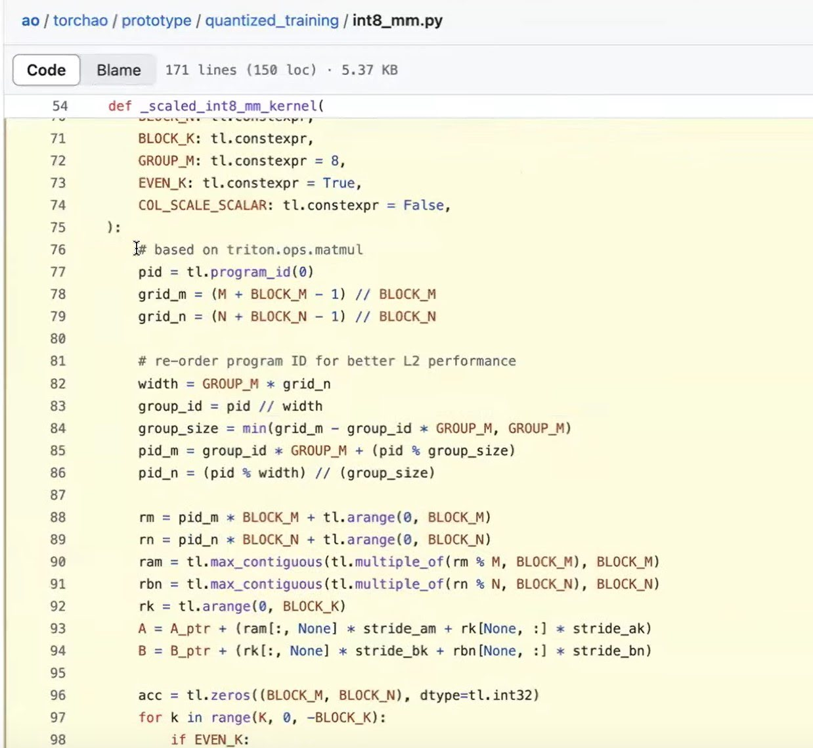

# JetFire fully INT8 training for Transformers
by using a novel `per-block quantization` scheme to **handle activation and gradient `outliers`**. By partitioning matrices into small blocks and scaling each block independently, JetFire preserved accuracy comparable to FP16 training while obtaining ∼40% end-to-end speedup and 1.49× reduction in memory usage. The JetFire approach is conceptually `similar to the FP8 DeepSeek training technique`, which used larger block sizes.

# HALO
improved upon JetFire in terms of the **accuracy-speedup trade-off** in INT8, specifically focusing on low-precision fine-tuning.

---

# INT8 mixed-precision training
- https://github.com/pytorch/ao/pull/748
- https://youtu.be/Br07GsnnvWc?t=1385
- thiếu smoothing?

- **Quantized training**: model weights are quantized. This is a strict requirement. Does not matter what is the compute precision. Examples of this: Q-GaLore, JetFire.

- **INT8 mixed-precision training**: model `weights are in bf16`, while `compute dtype for most ops is in INT8`. One difference is that in FP16/BF16 mixed-precision training, matmul will return FP16/BF16 outputs, while for INT8 mixed-precision training, the returned dtype is usually not INT8. Examples include Google AQT and SwitchBack.

There are 3 main benefits of using low-precision dtype for training (the extent depends on the actual strategies):

- `Memory`: reduce memory footprint by: 
  - model weights, 
  - activations,
  - gradients, and  
  - distributed communication bandwidth.

- `Speed`: 
  - speedup compute-bound ops with low-precision hardware instructions (e.g. INT8 Tensor Cores), and 
  - speedup memory-bound ops with quantized inputs/outputs.

- WYTIWYS (What you train is what you serve https://github.com/google/aqt)

## INT8 mixed-precision

In mixed-precision training, we can down-cast activations and weights dynamically to INT8 to leverage faster matmuls. However, since INT8 has very limited range [-128, 127], we perform `row-wise quantization`, similar to how **INT8 post-training quantization (PTQ) is done**. Weight is still in original precision.

> 3090/4090 INT8 tensor cores trong spec sheet là 4x faster than BF16 tensor cores.
> `Real benchmark thì cỡ 3-3.5x`

this blogpost https://cloud.google.com/blog/products/compute/accurate-quantized-training-aqt-for-tpu-v5e

- - -

# stochastic rounding

Tương tự như F32 training convert to FP16/BF16 khi tính toán để sử dụng tensor cores.
Mix int8, convert to int8 khi tính toán, còn lưu trữ vẫn cùng FP16/BF16 ...

=> có 1 giải pháp đơn giản cho vấn đề trên là SR (stochastic rounding)

!!! Thay vì làm tròn cứng thì sử dụng làm tròn có xác suất !!!

https://github.com/pytorch/ao/pull/644

SR cải thiện đáng kể bộ bf16 optimizer.

- - -

4090 được hưởng lợi nhiều từ 8-bit training, có thể 4x so với bf16, int8 nhanh tương đương A100
- Thực tế đo lường thì 4090's int8 x3.5 bf16.
- Áp dụng training thì `x1.7 lần` cho toàn bộ pipeline. 

int8 bị vấn đề độ chính xác thấp (sai số cao), xử lý bằng scaled matmul, 

`torch.compile` có thể dùng để quant nhưng nó chưa support 1 số thứ, ví dụ triton quant configs.
quant config giúp tăng chất lượng nhiều.

Đa phần code đc sinh bởi torch.compile và chỉ cần custom 1 số đoạn code (scale ...) áp dụng cho cả forward và backward

