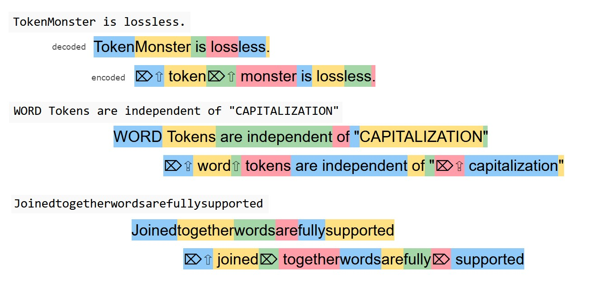

Ý tưởng Tuockenizer rất đơn giản:
- Tận dụng word boundaries để làm đơn vị phân tách
- Sử dụng n-gram + greedy search để tạo các tokens vượt quá ranh giới word boundaries
- Sử dụng sentencepiece BPE cho những phần còn lại
- Có thể dùng để mở rộng vocab của any LLM, dùng 2-pass tknz
  - 1st: lọc chuỗi âm tiết TV để đẩy qua ngram
  - 2nd: apply current tknz method cho phần còn lại 

KẾT QUẢ

```
# symonster 24k
avg. chars / token 5.6, avg. speed 1.1s / 1k doc

# tuockenizer 24k
avg. chars / token 5.5, avg. speed 1.8s / 1k doc
```

**Test trên tập wikipedia (ko có trong tuoc train)**
```
# symonster 24k
avg. chars / token 4.67, avg. speed 0.6s / 1k doc

# tuockenizer 24k
avg. chars / token 4.69, avg. speed 1.1s / 1k doc
```

- - -

## Symonster (Symato + Token Monster): tokenizer hoàn hảo cho Việt - Anh - Tàu - Code corpus

- Symato là gì? Symato là cách biểu diễn âm tiết tiếng Việt dưới dạng Symbol + Mark + Tone (người việt = nguoi|wf viet|zj) súc tích hơn, bao hàm cả cách viết không dấu và có dấu; chịu lỗi tốt hơn và hiệu quả hơn dạng utf-8

- Token monster là gì? Token monster là cách tokenization tối ưu, không phụ thuộc vào ngôn ngữ, hiệu quả hơn 35% các tokenizers dựa trên BPE thông thường.

- Kết hợp cách biểu diễn Symato và cách xây dựng bộ từ vựng của Token Monster, viết lại Token Monster bằng low level programming language sẽ giúp có một bộ tokenizer tối ưu cho tiếng Việt.




- Ý tưởng chọn đơn vị token của Tokenmonster tương đồng với ý tưởng chọn n-syllables làm tokens của Symato. Nếu tiếp tục phát triển 2 thứ đó sẽ hội tụ lại cho tiếng Việt.
- Ý tưởng capcode 2 bên cũng đã trùng nhau :)
- Tokenmonster giới thiệu `delete-token` để xóa dấu cách của "từ" không có dấu cách ở đằng trước.
- Một "từ" có thể coi là 1 đơn vị vocab đứng độc lập, nó thường đc phân định bởi dấu cách (space) nên sẽ đi kèm theo dấu cách ở đằng trước để phân biệt với subword.
- Một "nhỏ-hơn-từ" (subword) là một đơn vị không đứng độc lập mà đi cùng với các đơn vị khác để tạo thành một "từ"
- Cách ungreedy tknz của tkmonster là ở mỗi thời điểm họ chọn word có độ dài lớn nhất (tham lam), sau đó bẻ word đó ra bằng 1 đến 2 ứng cử viên subword (chuẩn bị sẵn trong quá trình training) để rẽ nhánh cây tìm kiếm.

=> Do ứng cử viên tối ưu thường là "từ" nên việc phân tách âm tiết TV thành symato là không cần thiết + ý tưởng capcode 2 bên đã trùng nhau nên dùng trực tiếp Tokenmonster sẽ tạo đc bộ từ vựng tối ưu cho tiếng Việt và nhiều ngôn ngữ khác.
